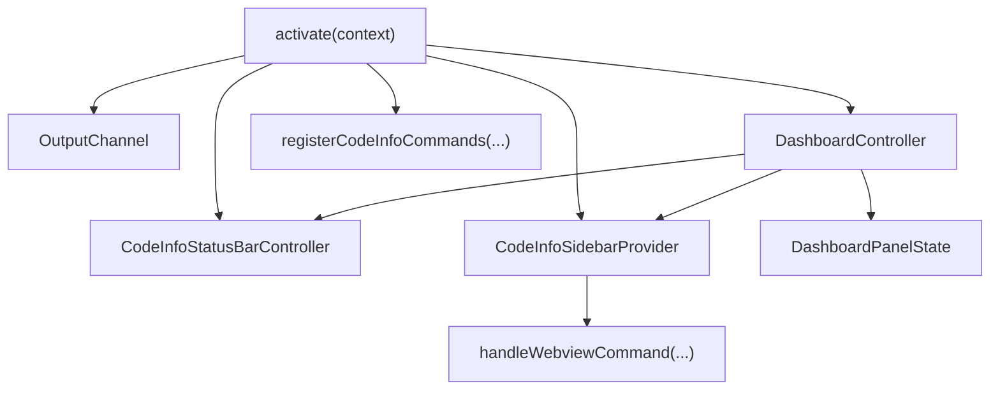
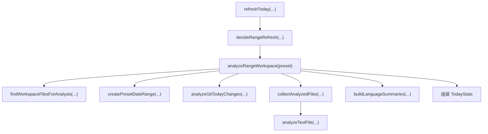
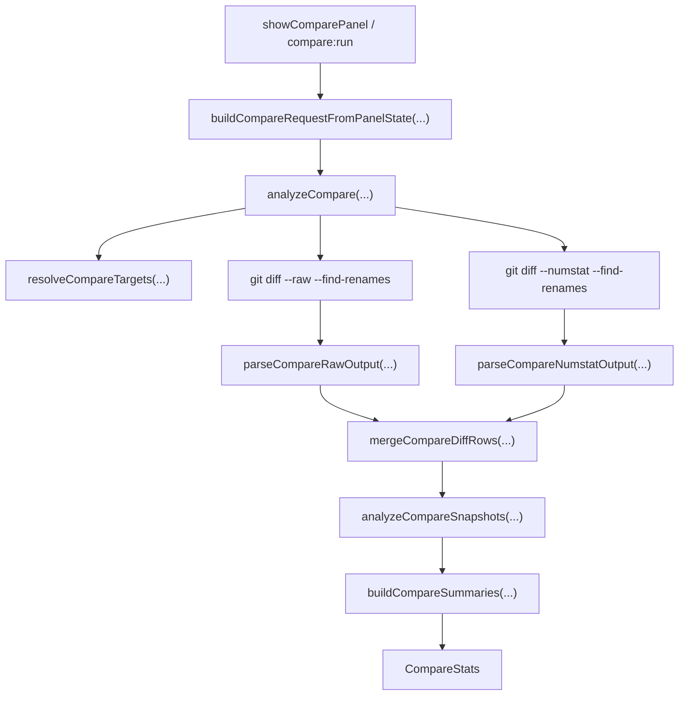

# Code Info 项目架构与功能说明

本文基于当前项目代码整理，目标是把这个 VS Code 插件从“入口如何启动”到“每个功能如何落地”完整串起来，方便后续维护、迭代和新成员接手。

## 1. 项目定位

`Code Info` 是一个 VS Code 扩展，用来分析当前工作区代码，并以侧边栏概览、完整看板、状态栏提示、变更对比页等多种方式展示结果。

当前能力主要分为 4 类：

1. 工作区全量分析
2. 时间范围统计分析（今天 / 最近 7 天 / 最近 30 天）
3. Git 变更对比分析
4. 结果导出与文件跳转

从用户视角，它是一个“以 VS Code 原生体验为主的代码分析插件”；从代码结构看，它现在已经被拆成了：

- 扩展入口与命令注册
- 状态与控制器
- 分析层
- Git 数据层
- UI / Webview 层
- 导出层

---

## 2. 插件清单与 VS Code 集成点

插件清单定义在 [package.json](/Users/tingfeng/Documents/code/github/vscode-code-info/code-info/package.json)。

### 2.1 基础信息

- 扩展主入口：`main = ./out/extension.js`
- 扩展图标：`resources/icon.png`
- Activity Bar 图标：`media/icon.svg`
- VS Code 版本要求：`^1.110.0`

### 2.2 注册的命令

当前命令包括：

- `codeInfo.showStats`
- `codeInfo.selectAnalysisDirectories`
- `codeInfo.openPanel`
- `codeInfo.openCompare`
- `codeInfo.refreshStats`
- `codeInfo.refreshTodayStats`
- `codeInfo.refreshLast7DaysStats`
- `codeInfo.refreshLast30DaysStats`
- `codeInfo.export`
- `codeInfo.exportJson`
- `codeInfo.exportCsv`

这些命令都在 [src/app/commandRegistry.ts](/Users/tingfeng/Documents/code/github/vscode-code-info/code-info/src/app/commandRegistry.ts) 里集中注册。

### 2.3 侧边栏视图

通过 `viewsContainers.activitybar` 和 `views.codeInfo` 注册了一个 Activity Bar 容器和一个 webview 视图：

- 容器 id：`codeInfo`
- 视图 id：`codeInfo.sidebar`

对应实现类在 [src/ui/sidebar.ts](/Users/tingfeng/Documents/code/github/vscode-code-info/code-info/src/ui/sidebar.ts)。

### 2.4 配置项

当前有两个核心配置：

- `codeInfo.analysis.directories`
- `codeInfo.analysis.moduleDepth`

读取和写入逻辑在 [src/config/settings.ts](/Users/tingfeng/Documents/code/github/vscode-code-info/code-info/src/config/settings.ts)。

---

## 3. 启动入口与初始化流程

扩展入口在 [src/extension.ts](/Users/tingfeng/Documents/code/github/vscode-code-info/code-info/src/extension.ts)。

### 3.1 activate 做了什么

`activate(context)` 目前非常“薄”，主要承担装配职责：

1. 创建输出面板 `OutputChannel`
2. 创建状态栏控制器 `CodeInfoStatusBarController`
3. 创建侧边栏 provider `CodeInfoSidebarProvider`
4. 创建业务控制器 `DashboardController`
5. 先把当前缓存状态渲染到侧边栏和状态栏
6. 注册 sidebar provider
7. 注册所有命令

这一步的重点是：入口文件不再直接承载分析逻辑，而是只负责把对象接起来。

### 3.2 启动时的对象关系

这里有两个长期存在的 UI 状态：

- `dashboardPanelState`：完整看板面板状态
- `comparePanelState`：变更对比面板状态

它们都在入口级单例变量里维护，以便命令之间复用已有面板。

---

## 4. 应用状态与控制器职责

### 4.1 应用状态

应用运行时状态定义在 [src/app/state.ts](/Users/tingfeng/Documents/code/github/vscode-code-info/code-info/src/app/state.ts)：

- `latestProjectStats`
- `latestTodayStats`
- `latestRangePreset`
- `refreshTodayTask`
- `refreshTodayTaskPreset`

这是一个轻量内存态，不做持久化。

### 4.2 DashboardController 的职责

[src/app/dashboardController.ts](/Users/tingfeng/Documents/code/github/vscode-code-info/code-info/src/app/dashboardController.ts) 是当前插件的核心编排器，主要负责：

1. 管理最新统计数据
2. 触发工作区全量分析
3. 触发范围统计分析
4. 处理刷新缓存复用逻辑
5. 同步更新侧边栏、状态栏和完整看板
6. 处理工作区切换后的状态重置

### 4.3 为什么要有控制器

因为这个扩展的多个 UI 面板其实共享同一份分析结果：

- 侧边栏要看
- 状态栏要看
- 完整看板要看
- 导出逻辑也要用

如果没有控制器，命令会重复触发分析、各自维护状态，代码很快会发散。现在控制器统一调度，UI 只负责展示。

---

## 5. 命令注册与执行链路

所有命令注册都在 [src/app/commandRegistry.ts](/Users/tingfeng/Documents/code/github/vscode-code-info/code-info/src/app/commandRegistry.ts)。

### 5.1 命令分组

可以把这些命令分成几类：

#### A. 打开界面

- `codeInfo.openPanel`
- `codeInfo.openCompare`

#### B. 触发分析

- `codeInfo.showStats`
- `codeInfo.refreshStats`
- `codeInfo.refreshTodayStats`
- `codeInfo.refreshLast7DaysStats`
- `codeInfo.refreshLast30DaysStats`

#### C. 配置分析范围

- `codeInfo.selectAnalysisDirectories`

#### D. 导出

- `codeInfo.export`
- `codeInfo.exportJson`
- `codeInfo.exportCsv`

### 5.2 典型命令链路

#### `codeInfo.showStats`

执行逻辑：

1. 调用 `controller.analyzeProject({ revealPanel: true })`
2. 如果当前还没有范围统计，则补一次 `refreshToday`
3. 如果已经有任意统计结果，就打开完整看板

这说明“完整看板”不是纯项目分析页，而是组合了：

- 范围统计
- 项目统计

#### `codeInfo.openPanel`

执行逻辑：

1. 如果没有范围统计，先补一次 `refreshToday`
2. 如果已有任何数据，直接打开完整看板
3. 如果没有数据，则打开空态 panel

这个命令更偏“打开 UI”，而不是强制全量分析。

#### `codeInfo.refreshStats`

执行逻辑：

1. 重新做一次项目分析
2. 强制刷新一次范围统计

它是最“重”的刷新入口。

#### `codeInfo.selectAnalysisDirectories`

执行逻辑：

1. 打开目录选择器
2. 更新工作区设置 `codeInfo.analysis.directories`
3. 清空旧的项目统计
4. 强制刷新范围统计
5. 重绘侧边栏
6. 如果完整看板开着，则让它回到空态

这意味着“分析范围变更”会主动失效旧统计，避免用户看到过期结果。

---

## 6. 范围统计分析链路

范围统计实现主要在 [src/analysis/todayAnalyzer.ts](/Users/tingfeng/Documents/code/github/vscode-code-info/code-info/src/analysis/todayAnalyzer.ts)。

虽然文件名叫 `todayAnalyzer`，但它现在实际支持：

- `today`
- `last7Days`
- `last30Days`

核心入口是：

- `analyzeTodayWorkspace()`
- `analyzeRangeWorkspace(preset)`

### 6.1 整体流程

### 6.2 数据来源

范围统计的数据来自两个来源：

#### A. 文件系统时间戳

使用 `fs.stat` 读取文件：

- `mtimeMs` 判断是否在时间范围内被修改
- `birthtimeMs / ctimeMs` 判断是否是“新文件”

对应逻辑在 `getTodayStatus(...)`。

#### B. Git 范围变更

通过 [src/git/today.ts](/Users/tingfeng/Documents/code/github/vscode-code-info/code-info/src/git/today.ts) 获取：

- 删除文件
- 新增行
- 删除行

因此“新增/修改文件”来自文件时间戳，而“删除文件和增删行”来自 Git 提交范围。

### 6.3 缓存与刷新策略

刷新策略在 [src/app/refreshPolicy.ts](/Users/tingfeng/Documents/code/github/vscode-code-info/code-info/src/app/refreshPolicy.ts)。

当前逻辑是：

- 默认短时间内复用同一范围最近结果
- 如果同一范围正在刷新，则等待 in-flight 任务
- 如果用户切换到了新范围，必要时在旧任务结束后重新跑
- `force: true` 时跳过缓存

这解决了两个问题：

1. 侧边栏可见时不至于频繁重复扫描
2. 用户快速切换范围时不会并发打爆分析流程

---

## 7. 工作区全量分析链路

全量分析在 [src/analysis/workspaceAnalyzer.ts](/Users/tingfeng/Documents/code/github/vscode-code-info/code-info/src/analysis/workspaceAnalyzer.ts)。

### 7.1 工作区分析总体步骤

1. 获取工作区与分析范围
2. 扫描文件列表
3. 过滤明显的二进制扩展名
4. 并发分析文本文件
5. 聚合总量、语言、目录、TODO、洞察、Git 趋势
6. 输出 `WorkspaceStats`

### 7.2 文件扫描入口

文件扫描在 [src/analysis/targets.ts](/Users/tingfeng/Documents/code/github/vscode-code-info/code-info/src/analysis/targets.ts)。

关键函数：

- `findWorkspaceFilesForAnalysis(...)`
- `isBinaryLike(...)`
- `getWorkerCount()`

`findWorkspaceFilesForAnalysis(...)` 会读取 `codeInfo.analysis.directories` 配置：

- 没配目录时分析全工作区
- 配了目录时只分析指定目录
- 多根工作区支持 `workspaceFolderName:dir`

### 7.3 并发分析模型

统一的并发处理逻辑在 [src/analysis/shared.ts](/Users/tingfeng/Documents/code/github/vscode-code-info/code-info/src/analysis/shared.ts) 的 `collectAnalyzedFiles(...)`。

它负责：

- 可选的预处理 `prepare`
- 并发消费 URI 列表
- 调用单文件分析器
- 累积条目结果
- 收集 TODO 位置
- 统计跳过的二进制文件与不可读文件

这个函数是“范围统计”和“工作区全量分析”的公共底座。

### 7.4 单文件分析

单文件分析入口在 [src/analysis/fileAnalyzer.ts](/Users/tingfeng/Documents/code/github/vscode-code-info/code-info/src/analysis/fileAnalyzer.ts)。

它负责：

- 读取文本内容
- 判断不可读 / 二进制内容
- 识别语言
- 统计行数、代码行、注释行、空行
- 抽取 TODO / FIXME / HACK 位置

行统计细节主要在：

- [src/analysis/lineMetrics.ts](/Users/tingfeng/Documents/code/github/vscode-code-info/code-info/src/analysis/lineMetrics.ts)
- [src/analysis/languageDetector.ts](/Users/tingfeng/Documents/code/github/vscode-code-info/code-info/src/analysis/languageDetector.ts)

### 7.5 聚合结果

聚合逻辑主要在 [src/analysis/summaries.ts](/Users/tingfeng/Documents/code/github/vscode-code-info/code-info/src/analysis/summaries.ts)。

会生成：

- 总量 `totals`
- 语言分布 `languages`
- 目录聚合 `directories`
- 目录树 `directoryTree`
- 最大文件排行 `largestFiles`
- TODO 摘要 `todoSummary`
- TODO 热点文件 `todoHotspots`
- 综合洞察 `insights`

### 7.6 Git 趋势

工作区 Git 趋势由 [src/git/history.ts](/Users/tingfeng/Documents/code/github/vscode-code-info/code-info/src/git/history.ts) 提供，结果挂在 `WorkspaceStats.git` 上。

内容包括：

- 最近 12 周提交趋势
- 总提交数
- Top 5 贡献者

---

## 8. 变更对比功能链路

“变更对比”是当前项目里相对独立的一条功能线。

相关文件：

- [src/ui/comparePanel.ts](/Users/tingfeng/Documents/code/github/vscode-code-info/code-info/src/ui/comparePanel.ts)
- [src/webview/compareTemplates.ts](/Users/tingfeng/Documents/code/github/vscode-code-info/code-info/src/webview/compareTemplates.ts)
- [src/analysis/compareAnalyzer.ts](/Users/tingfeng/Documents/code/github/vscode-code-info/code-info/src/analysis/compareAnalyzer.ts)
- [src/analysis/compareSnapshots.ts](/Users/tingfeng/Documents/code/github/vscode-code-info/code-info/src/analysis/compareSnapshots.ts)
- [src/analysis/compareSummaries.ts](/Users/tingfeng/Documents/code/github/vscode-code-info/code-info/src/analysis/compareSummaries.ts)
- [src/git/compare.ts](/Users/tingfeng/Documents/code/github/vscode-code-info/code-info/src/git/compare.ts)

### 8.1 UI 状态模型

`ComparePanelState` 维护：

- 模式：`branch` 或 `commit`
- `baseRef`
- `headRef`
- 分支选项列表
- 运行状态：`idle / loading / success / error`
- 最近一次结果
- 最近一次错误

### 8.2 打开 compare 面板时的行为

`showComparePanel(...)` 会：

1. 创建或复用 WebviewPanel
2. 渲染当前状态
3. 自动确保 branch 模式所需的分支列表已加载
4. 首次打开且状态空闲时，自动跑一次 compare

### 8.3 compare 计算流程

### 8.4 compare 的两个模式

#### A. branch 模式

默认是“当前分支 vs main/master”。

流程：

- 读取本地分支列表
- 获取当前分支
- 解析默认 base 分支（优先 main / master）
- 用分支名做 diff

#### B. commit 模式

用户手动输入：

- `baseRef`
- `headRef`

如果任一为空，则不允许执行 compare。

### 8.5 compare 输出内容

`CompareStats` 包含：

- 目标 refs
- 变更文件汇总
- 语言变化
- 目录变化
- 热点文件
- 文件快照与打开目标

### 8.6 文件打开与快照打开

打开逻辑在 [src/ui/resourceNavigator.ts](/Users/tingfeng/Documents/code/github/vscode-code-info/code-info/src/ui/resourceNavigator.ts)。

支持两类目标：

- `workspace`：直接打开工作区真实文件
- `snapshot`：打开虚拟文本快照

这使 compare 面板能处理：

- 当前分支中的真实文件
- 已删除文件的 base 快照
- rename 前后的快照对比入口

---

## 9. UI 架构

当前 UI 层可以分成 4 个部分：

1. Activity Bar 侧边栏
2. 完整 Dashboard 面板
3. Compare 面板
4. 状态栏

### 9.1 侧边栏

实现类在 [src/ui/sidebar.ts](/Users/tingfeng/Documents/code/github/vscode-code-info/code-info/src/ui/sidebar.ts)。

特点：

- 使用 `WebviewViewProvider`
- 紧凑模式展示
- 可在视图可见时触发范围统计刷新
- 接收 webview 按钮消息并转回 VS Code 命令

### 9.2 完整 Dashboard 面板

实现文件在 [src/ui/panels.ts](/Users/tingfeng/Documents/code/github/vscode-code-info/code-info/src/ui/panels.ts)。

职责：

- 创建或复用完整面板
- 根据当前数据渲染大看板
- 维护面板标题和图标
- 在数据更新后刷新已打开面板

### 9.3 Compare 面板

实现文件在 [src/ui/comparePanel.ts](/Users/tingfeng/Documents/code/github/vscode-code-info/code-info/src/ui/comparePanel.ts)。

职责：

- 维护 compare 独立状态机
- 处理分支模式初始化
- 处理用户消息和 compare 执行
- 渲染 compare webview

### 9.4 状态栏

实现文件在 [src/ui/statusBar.ts](/Users/tingfeng/Documents/code/github/vscode-code-info/code-info/src/ui/statusBar.ts)。

状态栏只关心 `TodayStats`，不关心项目全量统计。

它展示：

- 加载中状态
- 范围内改/新/删文件摘要
- tooltip 中的详细说明

用户点击状态栏会执行 `codeInfo.openPanel`。

---

## 10. Webview 架构

### 10.1 Dashboard Webview

Dashboard 相关文件：

- [src/webview/templates.ts](/Users/tingfeng/Documents/code/github/vscode-code-info/code-info/src/webview/templates.ts)
- [src/webview/dashboardShell.ts](/Users/tingfeng/Documents/code/github/vscode-code-info/code-info/src/webview/dashboardShell.ts)
- [media/webview/dashboard.js](/Users/tingfeng/Documents/code/github/vscode-code-info/code-info/media/webview/dashboard.js)
- [media/webview/macos26.css](/Users/tingfeng/Documents/code/github/vscode-code-info/code-info/media/webview/macos26.css)

#### 当前边界

现在的 dashboard 已经不是“一个模板字符串里塞满 HTML + JS”的旧结构，而是：

- `templates.ts`：生成空态和 dashboard 入口 HTML
- `dashboardShell.ts`：负责 webview 资源地址和 shell HTML
- `dashboard.js`：负责 dashboard 运行时渲染与交互
- `macos26.css`：统一样式

#### 为什么这样拆

这样拆后有几个直接收益：

1. `extension.ts` 和 UI 层不需要再维护大段内联脚本
2. dashboard 交互逻辑可以单独调试
3. 资源路径统一构建，侧边栏和大看板复用同一套资源
4. 未来继续拆 `dashboard.js` 时边界已经准备好了

#### Dashboard 数据注入方式

`getDashboardHtml(...)` 会把：

- `data`
- `presentation`

序列化成 JSON payload，注入到页面中，再由 `dashboard.js` 读取并完成渲染。

#### 兜底机制

如果 `scriptUri` 缺失，`templates.ts` 会输出静态 fallback 摘要，而不是空白页。

### 10.2 Compare Webview

Compare 页结构比 dashboard 更简单，目前仍然主要在 [src/webview/compareTemplates.ts](/Users/tingfeng/Documents/code/github/vscode-code-info/code-info/src/webview/compareTemplates.ts) 中以模板字符串生成。

它的特点是：

- 结构简单
- 状态有限
- 交互事件少

所以当前还没有像 dashboard 那样拆出独立 runtime 文件。

---

## 11. Webview 与命令桥接

webview 内部按钮点击不会直接做业务逻辑，而是先发消息给扩展侧。

桥接逻辑在 [src/ui/webviewCommands.ts](/Users/tingfeng/Documents/code/github/vscode-code-info/code-info/src/ui/webviewCommands.ts)。

### 11.1 dashboard 消息

支持的消息包括：

- `refresh`
- `refreshToday`
- `refreshLast7Days`
- `refreshLast30Days`
- `selectScope`
- `showStats`
- `openPanel`
- `openCompare`
- `exportJson`
- `exportCsv`
- `openFile`
- `openLocation`

### 11.2 设计思路

这里采用了“Webview -> message -> VS Code command”的转发模式，而不是直接在 webview 里耦合业务。

好处是：

- 前端层更轻
- 行为统一复用同一套命令
- 命令面板、按钮、侧边栏操作逻辑一致

---

## 12. 分析范围配置与目录选择

目录选择器在 [src/ui/scopePicker.ts](/Users/tingfeng/Documents/code/github/vscode-code-info/code-info/src/ui/scopePicker.ts)。

支持三种方式：

1. 全工作区
2. 从文件系统选择目录
3. 手动输入目录

多根工作区格式支持：

- `client:src`
- `server:packages/api`

标准化逻辑在 [src/analysis/scope.ts](/Users/tingfeng/Documents/code/github/vscode-code-info/code-info/src/analysis/scope.ts)。

这些配置最终都会流向 `findWorkspaceFilesForAnalysis(...)`，从源头限制扫描范围。

---

## 13. 导出能力

导出逻辑在 [src/export/exporter.ts](/Users/tingfeng/Documents/code/github/vscode-code-info/code-info/src/export/exporter.ts)。

支持两种格式：

- JSON
- CSV

### 13.1 导出策略

- 默认导出文件名：`<workspaceName>-code-info.<ext>`
- 默认保存在第一个工作区根目录下
- JSON 直接导出 `WorkspaceStats`
- CSV 以 section 形式拆分摘要、语言、目录、热点、文件列表

### 13.2 限制

目前导出仅基于 `WorkspaceStats`，不包含 `TodayStats` 和 `CompareStats`。

如果后续要扩展，可以考虑：

- 导出范围统计
- 导出 compare 结果
- 导出 HTML 报告

---

## 14. 类型结构概览

核心类型集中在 [src/types.ts](/Users/tingfeng/Documents/code/github/vscode-code-info/code-info/src/types.ts)。

最关键的几个聚合结果类型：

- `FileStat`
- `TodayStats`
- `WorkspaceStats`
- `DashboardData`
- `CompareStats`
- `CompareFileSnapshot`

可以这样理解：

- `FileStat` 是基础颗粒度
- `TodayStats` 是“某个时间范围内有变更的文件集合”统计
- `WorkspaceStats` 是“整个分析范围内全部文本文件”统计
- `DashboardData` 是 dashboard 的聚合输入
- `CompareStats` 是 compare 页的聚合输入

---

## 15. 测试结构

当前测试主要分成两组：

- [src/test/extension.test.ts](/Users/tingfeng/Documents/code/github/vscode-code-info/code-info/src/test/extension.test.ts)
- [src/test/compare.test.ts](/Users/tingfeng/Documents/code/github/vscode-code-info/code-info/src/test/compare.test.ts)

### 15.1 extension.test.ts 覆盖内容

主要覆盖：

- 行统计
- 目录聚合
- 范围刷新策略
- Dashboard shell / payload
- 空态按钮
- Webview 资源构建

### 15.2 compare.test.ts 覆盖内容

主要覆盖：

- Git compare 目标解析
- raw / numstat 解析
- snapshot 生成
- compare 汇总
- compare panel 状态机
- compare HTML 输出

这说明项目目前已经有一套比较明确的“分析逻辑可测试、UI 结构可回归”的测试思路。

---

## 16. 文件职责地图

如果从“快速理解项目”的角度，可以按下面这张地图记忆：

### 16.1 入口与应用层

- [src/extension.ts](/Users/tingfeng/Documents/code/github/vscode-code-info/code-info/src/extension.ts)：扩展入口
- [src/app/commandRegistry.ts](/Users/tingfeng/Documents/code/github/vscode-code-info/code-info/src/app/commandRegistry.ts)：命令注册
- [src/app/dashboardController.ts](/Users/tingfeng/Documents/code/github/vscode-code-info/code-info/src/app/dashboardController.ts)：主控制器
- [src/app/state.ts](/Users/tingfeng/Documents/code/github/vscode-code-info/code-info/src/app/state.ts)：内存状态
- [src/app/refreshPolicy.ts](/Users/tingfeng/Documents/code/github/vscode-code-info/code-info/src/app/refreshPolicy.ts)：范围刷新策略

### 16.2 分析层

- [src/analysis/workspaceAnalyzer.ts](/Users/tingfeng/Documents/code/github/vscode-code-info/code-info/src/analysis/workspaceAnalyzer.ts)：全量工作区分析
- [src/analysis/todayAnalyzer.ts](/Users/tingfeng/Documents/code/github/vscode-code-info/code-info/src/analysis/todayAnalyzer.ts)：时间范围分析
- [src/analysis/fileAnalyzer.ts](/Users/tingfeng/Documents/code/github/vscode-code-info/code-info/src/analysis/fileAnalyzer.ts)：单文件分析
- [src/analysis/shared.ts](/Users/tingfeng/Documents/code/github/vscode-code-info/code-info/src/analysis/shared.ts)：并发公共逻辑
- [src/analysis/summaries.ts](/Users/tingfeng/Documents/code/github/vscode-code-info/code-info/src/analysis/summaries.ts)：聚合汇总
- [src/analysis/targets.ts](/Users/tingfeng/Documents/code/github/vscode-code-info/code-info/src/analysis/targets.ts)：扫描目标与范围解析

### 16.3 Git 层

- [src/git/today.ts](/Users/tingfeng/Documents/code/github/vscode-code-info/code-info/src/git/today.ts)：范围 Git 变更
- [src/git/history.ts](/Users/tingfeng/Documents/code/github/vscode-code-info/code-info/src/git/history.ts)：历史趋势
- [src/git/compare.ts](/Users/tingfeng/Documents/code/github/vscode-code-info/code-info/src/git/compare.ts)：compare 解析
- [src/git/common.ts](/Users/tingfeng/Documents/code/github/vscode-code-info/code-info/src/git/common.ts)：Git 公共工具

### 16.4 UI 层

- [src/ui/sidebar.ts](/Users/tingfeng/Documents/code/github/vscode-code-info/code-info/src/ui/sidebar.ts)：侧边栏
- [src/ui/panels.ts](/Users/tingfeng/Documents/code/github/vscode-code-info/code-info/src/ui/panels.ts)：完整 dashboard 面板
- [src/ui/comparePanel.ts](/Users/tingfeng/Documents/code/github/vscode-code-info/code-info/src/ui/comparePanel.ts)：变更对比面板
- [src/ui/statusBar.ts](/Users/tingfeng/Documents/code/github/vscode-code-info/code-info/src/ui/statusBar.ts)：状态栏
- [src/ui/webviewCommands.ts](/Users/tingfeng/Documents/code/github/vscode-code-info/code-info/src/ui/webviewCommands.ts)：webview 消息桥接
- [src/ui/resourceNavigator.ts](/Users/tingfeng/Documents/code/github/vscode-code-info/code-info/src/ui/resourceNavigator.ts)：资源打开
- [src/ui/scopePicker.ts](/Users/tingfeng/Documents/code/github/vscode-code-info/code-info/src/ui/scopePicker.ts)：目录范围选择器

### 16.5 Webview 层

- [src/webview/templates.ts](/Users/tingfeng/Documents/code/github/vscode-code-info/code-info/src/webview/templates.ts)：dashboard HTML 入口
- [src/webview/dashboardShell.ts](/Users/tingfeng/Documents/code/github/vscode-code-info/code-info/src/webview/dashboardShell.ts)：dashboard shell
- [src/webview/compareTemplates.ts](/Users/tingfeng/Documents/code/github/vscode-code-info/code-info/src/webview/compareTemplates.ts)：compare HTML
- [media/webview/dashboard.js](/Users/tingfeng/Documents/code/github/vscode-code-info/code-info/media/webview/dashboard.js)：dashboard 前端运行时

### 16.6 其他

- [src/export/exporter.ts](/Users/tingfeng/Documents/code/github/vscode-code-info/code-info/src/export/exporter.ts)：导出
- [src/config/settings.ts](/Users/tingfeng/Documents/code/github/vscode-code-info/code-info/src/config/settings.ts)：配置
- [src/types.ts](/Users/tingfeng/Documents/code/github/vscode-code-info/code-info/src/types.ts)：共享类型

---

## 17. 现阶段架构特点总结

当前项目的结构已经有比较清晰的层次感，主要特点是：

1. 扩展入口足够薄，主要逻辑集中在控制器和分析层
2. 命令注册已经集中化，避免散落在各文件
3. 范围统计和全量分析共享底层文件分析能力
4. compare 作为独立能力线，状态、分析、模板都相对成体系
5. dashboard 已开始从“超长模板字符串”向“shell + 外部脚本”过渡

---

## 18. 后续建议的演进方向

基于当前项目结构，比较自然的下一步演进方向有：

### 18.1 继续拆 dashboard 前端运行时

当前 [media/webview/dashboard.js](/Users/tingfeng/Documents/code/github/vscode-code-info/code-info/media/webview/dashboard.js) 仍然偏大，建议继续拆成：

- `renderers`
- `charts`
- `menus`
- `actions`
- `formatters`

### 18.2 给导出能力补更多结果类型

目前导出只有 `WorkspaceStats`，后续可以扩展：

- `TodayStats`
- `CompareStats`
- 合并报告

### 18.3 抽离统一的 panel/icon/resource 工具

现在 dashboard panel 和 compare panel 已经有部分重复模式，可以进一步统一成更通用的 panel helper。

### 18.4 增加更多工程指标

例如：

- 测试文件占比
- 配置文件占比
- 大文件阈值预警
- 模块复杂度趋势

---

## 19. 一句话理解当前代码结构

如果要用一句话概括当前项目：

> 这是一个以 `DashboardController` 为编排中心、以文件分析与 Git 分析为数据底座、通过 VS Code 原生命令与 Webview 展示多个统计视图的代码分析扩展。

